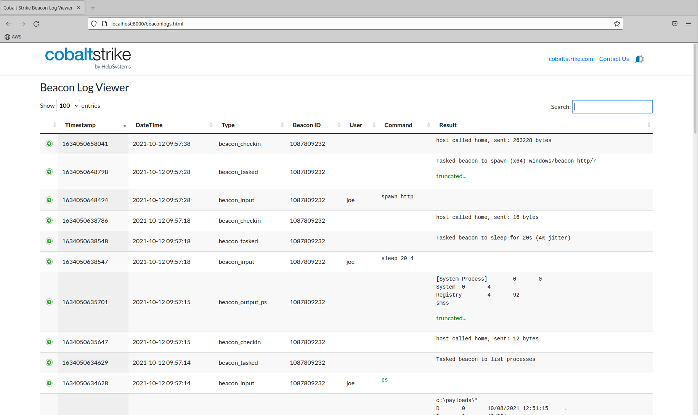
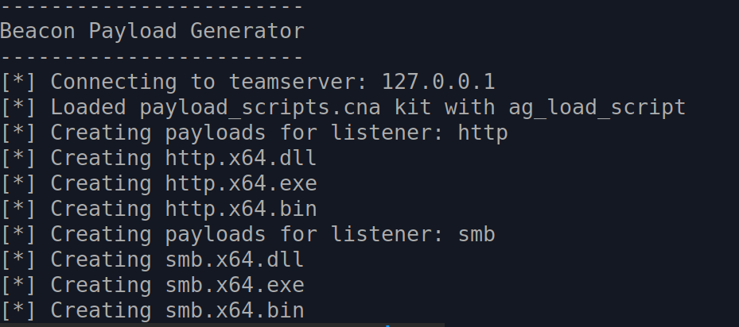
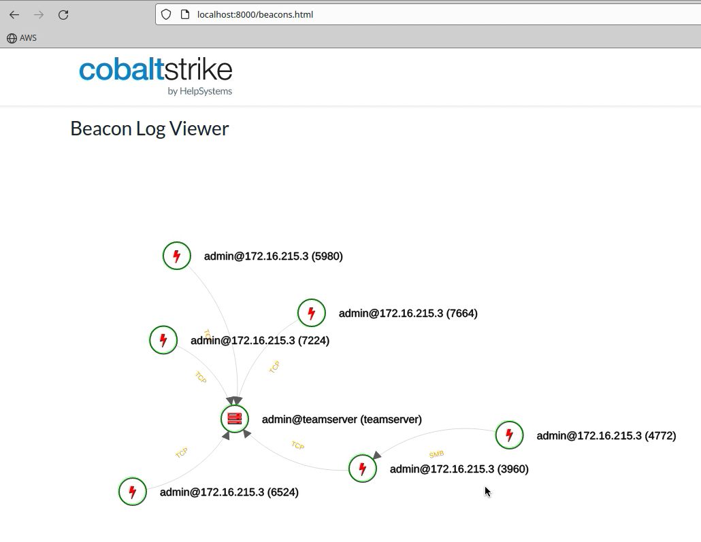

# Cobalt Strike Sleep Python Bridge

This project is 'bridge' between the sleep and python language. It allows the control of a Cobalt Strike teamserver through python without the need for the standard GUI client. 

NOTE: This project is very much in BETA. The goal is to provide a playground for testing and is in no way an officially support feature. Perhaps this could be something added in the future to the core product.

The project was inspired by the work done by @BinaryFaultline and @Mcgigglez16 in the project https://github.com/emcghee/PayloadAutomation. I want to offer a special thanks you both !!

The heart of this bridge is a python implementation of a headless Cobalt Strike client. This is achieved by using the Aggressor Script Console provided by **agscript** as the engine. Agscript allows for headless interaction with Cobalt Strike (https://www.cobaltstrike.com/aggressor-script/index.html). The 'bridge' works by using python helper functions in sleepy.py to generate the needed sleep commands expected by the agscript console. Instead of writing the sleep functions, striker.py provides helper functions that abstracts sleep and allows the use of python. 

## Changes of note from the original project

Because the PayloadAutomation project inspired this, it started with much of the same code, but I wanted to strip this down to use the components needed to act as an agscript wrapper.

- Renamed from Payload_Automation to sleep_python_bridge. This project is more than payload generation.
- Changed from a PyPI library to local modules. This was down for testing and may be a good candidate for a python library after extensive testing
- Updated and added helpers to match aggressor versions
- Add ability to load external script.

## Included Libraries

- Striker: A set of functions to interact with Cobalt Strike and execute functionality typically only accessible via Sleep/GUI.
- Sleepy: A set of functions to help facilitate a bridge between Sleep objects and Python objects.
- Compyler: A set of functions to compile various payloads from platform or cross-platform.
- Artifactor: A set of functions to inspect and review artifacts and collect and track IoCs.

## Files and Directories

Item                | Description
--------------------|------------
sleep_python_bridge | The library that allows python to interface with Cobalt Strike
output/html         | path for html data viewers
output/html/data    | path for json data used by data viewer
output/payloads     | path for saved payloads (used by payload generator)
payload_scripts     | path for external scripts to be loaded by payloadgenerator.py
beaconlogtracker.py | Implementation of a beacon log tracker the uses an HTML datagrid to display beacon logs
payloadgenerator.py | Implementation of a beacon payload generator that create payloads for each listener
beacongrapher.py    | Implementation of a beacon graph tracker the uses an HTML javascript directed graph to beacons

## TODO

- Document the exposed functions
- move compile based functions from striker.py to compyler.py
- Add additional error checking, specifically for application dependencies
- Expand compyler to include remote builds and mingw
- Add IOC tracking to payloads generated via artifactor.py
- handle error: "User is already connected."
- Consider converting this to a formal python library

---

## How to use

The examples in this project may be the easiest way to understand but is the script example.py

```Python
#!/usr/local/bin/python3

## Import the bridge
from sleep_python_bridge.striker import CSConnector
from argparse import ArgumentParser
from pprint import pp, pprint

###################
## Argparse
def parseArguments():
    parser = ArgumentParser()
    parser.add_argument('host', help='The teamserver host.')
    parser.add_argument('port', help='The teamserver port.')
    parser.add_argument('username', help='The desired username.')
    parser.add_argument('password', help='The teamserver password.')
    parser.add_argument('path', help="Directory to CobaltStrike")
    
    args = parser.parse_args()
    return args

## Let's go
def main(args):

    cs_host = args.host
    cs_port = args.port
    cs_user = args.username
    cs_pass = args.password
    cs_directory = args.path

    ## Connect to server
    print(f"[*] Connecting to teamserver: {cs_host}")
    with CSConnector(
        cs_host=cs_host, 
        cs_port=cs_port, 
        cs_user=cs_user, 
        cs_pass=cs_pass,
        cs_directory=cs_directory) as cs:

        # Perform some actions
        # 
        # Get beacon metadata - i.e., x beacons() from the script console
        beacons = cs.get_beacons()
        print("BEACONS")
        pprint(beacons)

        # Get list of listners - i.e., x listeners_stageless() from the script console
        listeners = cs.get_listeners_stageless()
        print("LISTENERS")
        pprint(listeners)

if __name__ == "__main__":
    args = parseArguments()
    main(args)
```

Call the script

```bash
python3 example.py 127.0.0.1 50050 example password /path/to/cobaltstrike
```

## Practical Examples

### Log Tracker



Beacon logs are available at runtime in a teamserver or through the beacon log files saved on the teamserver. The data is always there, but may not be presented in a way you would like. This is an example of log tracker that use an HTML data grid to quickly view beacon logs.

`beaconlogtracker.py` is a script that connects to a teamserver, extracts the running beacon logs every 30 seconds, saves to `<code>`beaconlogs.json` and, displays in a searchable and sortable HTML data grid.

Beacons logs are always saved to the logs directory, but this is an alternate way to track the in memory logs with an alternate viewer. If the teamserver is restarted the in memory logs are lost, and you must refer to the logs stored in the logs directory on the teamserver. This script keep in memory logs synced to the file `beaconlogs.json`. This way you have a quick and easy way to visualize all data without digging through the logs directory even if Cobalt Strike is restarted.

Start the script by having it connect to your teamserver to sync logs every 30 seconds

Usage: 

`python3 beaconlogtracker.py 127.0.0.1 50050 logtracker password /path/to/cobaltstrike`

This will keep beaconlogs.json sync'd with saved and running beacon logs. It syncs every 30 seconds

Start a webserver from output/html directory

`python3 -m http.server 8000`

Connect to http://localhost:8000/beaconlogs.html

### Payload Generator



A feature often requested by red team operators is the ability to create payloads programmatically without the need for the Cobalt Strike GUI. The reference project did this with a payload generator. This was great, but there is a unique challenge. Aggressor provides several hooks to influence how a payload is built. These hooks are used by the various kits (i.e., artifact kit, sleep mask kit, or UDRL kit). They are normally used by loading an aggressor script through the GUI. This project was extended to allow the loading of external scripts. Without this, using this payload hooks would be difficult. This code could easily be extended to pass the payloads to external functions to add custom obfuscation, embed in a customer loader, or any other modification.

The payload generator script connects to the teamserver, loads the additional scripts, and creates payloads.

#### Usage (No external kits):

- run `python3 payloadgenerator.py 127.0.0.1 50050 payloads password /path/to/cobaltstrike`

#### Usage (with external kit)

This example will list the steps to add the Arsenal kit which has the artifact and sleep mask kits enabled.

- Update the /path/to/arsenal_kit/arsenal_kit.config file to enable the artifact and sleep mask kits
- [Optional] Make any modifications to the artifact and sleep mask kits as needed
- Build the arsenal kit with /path/to/arsenal_kit/build_arsenal_kit.sh
- Copy the arsenal kit distribution files to the payload_scripts directory.  
`cp -r /path/to/arsenal_kit/dist/* /path/to/sleep_python_bridge/payload_scripts`
- [Optional] See logging section for more information on additional modifications 
- run `python3 payloadgenerator.py 127.0.0.1 50050 payloads password /path/to/cobaltstrike`

#### logging

Normally when using the GUI the external scripts can use the `println` aggressor function to output information to the Script Console which is useful for feedback or debugging. When using the payloadgenerator.py the `println` output is lost and the only option that is available is the `elog` function.  When using `elog` the GUI is needed to view the information in the Event Log.  

Continuing from the 'with external kit' usage example lets update the /path/to/sleep_python_bridge/payload_scripts/arsenal_kit.cna file and change the two occurrences of `println` to `elog`.  With this change all the arsenal kit logging will now be available in the GUI Event Log.

#### Loading of external scripts

Loading external scripts is not always needed except for payload modification scripts that include payload hooks (i.e., artifact, sleep mask, and udrl kits). If you load scripts from the Cobalt Strike GUI, payloads will honor these scripts from the GUI but not from the agscript client (These are different clients). You must add the scripts and supporting files into the payload_scripts directory. 

The payloadgenerator.py will automatically load any `.cna` script that is located at the top level payload_scripts directory.  Any `.cna` script that is located in a subdirectory will not be loaded. 

Example directory structure with the Arsenal Kit.
```
$ ls -1R ./payload_scripts
./payload_scripts:
arsenal_kit.cna
artifact
sleepmask

./payload_scripts/artifact:
artifact32big.dll
artifact32big.exe
artifact32.dll
artifact32.exe
artifact32svcbig.exe
artifact32svc.exe
artifact64big.exe
artifact64big.x64.dll
artifact64.exe
artifact64svcbig.exe
artifact64svc.exe
artifact64.x64.dll
artifact.cna

./payload_scripts/sleepmask:
sleepmask.cna
sleepmask_pivot.x64.o
sleepmask_pivot.x86.o
sleepmask.x64.o
sleepmask.x86.o
```

#### Usage (additional options for 4.8)

Thanks to a recent update provided by @mgeeky the payloadgenerator.py script now supports additional arguments to support new artifact_payload function parameters added in 4.8.  With these arguments you now have more control over what payloads are generated.

```
$ python3 payloadgenerator.py --help
------------------------
Beacon Payload Generator
------------------------
usage: payloadgenerator.py [-h] [-o path] [-l name] [-a arch] [-t types] [-e exit] [-c method] host port username password path

positional arguments:
  host                  The teamserver host.
  port                  The teamserver port.
  username              The desired username.
  password              The teamserver password.
  path                  Directory to CobaltStrike

optional arguments:
  -h, --help            show this help message and exit

optional parameters:
  -o path, --payload-path path
                        Where to save generated payloads. Default: output/payloads/
  -l name, --listener name
                        Specify listener name to get payloads for. Default: payloads for all listeners will be produced
  -a arch, --arch arch  Specify payload architecture. Choices: x86, x64. Default: payloads for both are generated
  -t types, --payload-types types
                        Comma separated list of payload types to generate keyed by file extensions. Choices: exe,dll,svc.exe,bin,ps1,py,vbs or use 'all' to compile all at once.
                        Default: exe,dll,bin
  -e exit, --exit exit  Payload exit method. Choices: thread, process. Default: process
  -c method, --call-method method
                        System call method. Choices: indirect, direct, none. Default: <empty> (backwards compatible with Cobalt pre 4.8)
```

#### Examples

```
$python3 payloadgenerator.py 127.0.0.1 50050 payloads password /path/to/cobaltstrike -o /share/payloads/ -c indirect -a x64
------------------------
Beacon Payload Generator
------------------------
[*] Connecting to teamserver: 127.0.0.1
Loading cna scripts from ./payload_scripts

Scripts
-------
arsenal_kit.cna
console.cna

[*] Creating stageless payloads for listener: http1
[*] Creating http1.x64.exe
[*] Creating http1.x64.dll
[*] Creating http1.x64.bin

$python3 payloadgenerator.py 127.0.0.1 50050 payloads password /path/to/cobaltstrike -o /share/payloads/ -c indirect -a x64 -t exe
------------------------
Beacon Payload Generator
------------------------
[*] Connecting to teamserver: 127.0.0.1
Loading cna scripts from ./payload_scripts

Scripts
-------
arsenal_kit.cna
console.cna

[*] Creating stageless payloads for listener: http1
[*] Creating http1.x64.exe

$python3 payloadgenerator.py 127.0.0.1 50050 payloads password /path/to/cobaltstrike -o /share/payloads/
------------------------
Beacon Payload Generator
------------------------
[*] Connecting to teamserver: 127.0.0.1
Loading cna scripts from ./payload_scripts

Scripts
-------
arsenal_kit.cna
console.cna

[*] Creating stageless payloads for listener: http1
[*] Creating http1.x86.exe
[*] Creating http1.x86.dll
[*] Creating http1.x86.bin
[*] Creating http1.x64.exe
[*] Creating http1.x64.dll
[*] Creating http1.x64.bin
```
### Beacon Grapher



This is beta code that will display beacon in a directed graph.

The script updates the file output/data/beacons.json

Start a webserver and open http://localhost:8000/beacons.html

Usage:

`python3 beacongrapher.py 127.0.0.1 50050 grapher password /path/to/cobaltstrike`

This will create the beacons.json file used by the javascript grapher.

Start a webserver from output/html directory

`python3 -m http.server 8000`

Connect to http://localhost:8000/beacons.html

